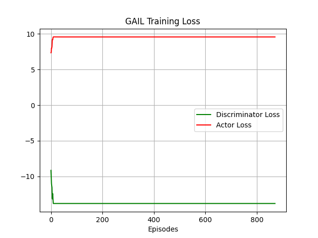
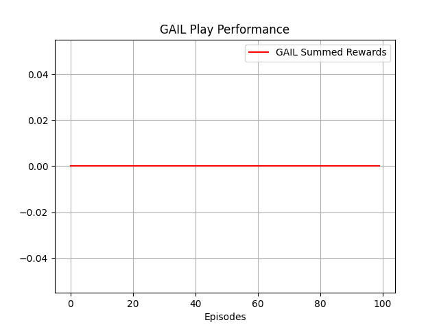

# GAIL Implementation using TF2 on ['CartPole-V1'](https://gym.openai.com/envs/CartPole-v1/)
This repository implements 'GAIL' Implementation using TF2.

## Expert Training & Evaluation
1. The openai-gym's ['CartPole-V1'](https://gym.openai.com/envs/CartPole-v1/) is solved using DDPG Deep RL Agent.
2. Data is saved in '.npy' format.
3. DDPG is [sourced](https://github.com/KanishkNavale/Trajectory-Planning-using-HER-and-Reward-Engineering/blob/master/HER/ddpg.py) & tailored accordingly to match the environment parameters.

|Training Log|Performance Test|
|:---:|:---:|
|||

## GAIL Training & Evaluation
|Training Loss|Training Log|Performance Test|
|:---:|:---:|:---:|
||||

## Developer
* Name: Kanishk Navale
* Website: https://kanishknavale.github.io/
* E-Mail: navalekanishk@gmail.com

## TODO
1. Improve the 'actor' & 'descriminator' networks.
